# Examen Segunda Evaluación Diseño Web y Desarrollo Cliente

# Día 17/02/2025 Tiempo: 5 horas

- Nota: Cada pregunta se valorará como bien o como mal (valoraciones intermedias serán excepcionales).
- Nota2: Cada pregunta computará únicamente en el examen al que pertenezca (diseño o desarrollo).
- Nota3: Para aprobar cada examen hay que obtener una puntuación mínima de 5 puntos en ese examen.
- Nota4: Organice su tiempo. Si no consigue resolver un apartado pase al siguiente. El examen consta de apartados de diseño y de desarrollo que se pueden resolver por separado. Si un apartado depende de otro que no sabe resolver, siempre puede dar una solución que aunque no sea correcta, le permita seguir avanzando.
- Nota5: Para que una solución sea correcta, no sólo hay que conseguir que haga lo que se pide, sino que, además, **todo lo que funcionaba lo tiene que seguir haciendo**. La solución debe estar implementada según las prácticas de código limpio explicadas en clase. Esto incluye React, JavaScript, CSS y HTML. No debe haber errores de tipos ni de ejecución.
- Nota6: Lea completamente el examen antes de empezar y comience por lo que le parezca más fácil.
- Nota7: No se permite utilizar ninguna librería que no esté ya incluida en el fichero `package.json`.
- Nota8: El examen de diseño se puede resolver usando CSS, SASS o TailwindCSS.

Pasos previos antes de empezar

- Clone el repositorio del enunciado

```bash
git clone https://gitlab.com/surtich/enunciado-examen-segunda-2024-2025.git
```

- Vaya al directorio del proyecto

```bash
cd enunciado-examen-segunda-2024-2025
```

- Si no lo ha hecho anteriormente, configure su usuario de git:

```bash
git config user.name "Sustituya por su nombre y apellidos"
git config user.email "Sustituya por su correo electrónico"
```

- Cree un _branch_ con su nombre y apellidos separados con guiones (no incluya mayúsculas, acentos o caracteres no alfabéticos, excepción hecha de los guiones). Ejemplo:

```bash
    git checkout -b fulanito-perez-gomez
```

- Compruebe que está en la rama correcta:

```bash
    git status
```

- Suba la rama al repositorio remoto:

```bash
    git push origin <nombre-de-la-rama-dado-anteriormente>
```

- Instale las dependencias:

```bash
    npm install
```

- Prepare la base de datos (puede omitir este paso ya que la base de datos se suministra ya actualizada):

```bash
    npx prisma db push
    npx prisma db seed
```

Arranque el servidor:

```bash
    npm run dev
```

Navegue a [http://localhost:3000](http://localhost:3000)

- Dígale al profesor que ya ha terminado para que compruebe que todo es correcto y desconecte la red.

# INTRODUCCIÓN

Ahora una receta puede pertenecer a cero, una o varias categorías y cada categoría puede tener cero, una o varias recetas. Es decir, la relación entre recetas y categorías es muchos a muchos.

Para hacer esto, se ha creado el modelo `Category` con la siguiente definición:

```typescript
model Category {
  id String @id @default(cuid())
  name String
  thumb String
  description String
  recipes Recipe[]
}
```

Donde, `thumb` es el nombre del fichero de la imagen de la categoría. Por ejemplo, la categoría `Beef` tiene en el campo `thumb` el valor de `beef.png`. Para acceder a la imagen hay que visitar la ruta `/images/categories/beef.png`. Se puede comprobar en esta ruta:


`http://localhost:3000/images/categories/beef.png`

Además, se ha añadido un campo `categories` al modelo `Recipe`:

```typescript
model Recipe {
  id String @id @default(cuid())
  name String
  ...
  categories Category[]
  ingredients Ingredient[]
}
```

En Prisma este tipo de relaciones, que no se definen de forma explícita, se llaman implícitas y son más fáciles de manejar.

Para consultar con `JavaScript` las recetas de una categoría, se puede hacer de la siguiente forma:

```javascript
const recipes = await prisma.category.findUnique({
  where: {
    id: "1",
  },
  include: { recipes: true },
});
```

Se puede añadir una receta a una categoría de la siguiente forma:

```javascript
await db.recipe.update({
  where: { id: recipeId },
  data: {
    categories: {
      connect: [{ id: category.id }],
    },
  },
});
```

Y para eliminar una receta de una categoría:

```javascript
await db.recipe.update({
  where: { id: recipeId },
  data: {
    categories: {
      disconnect: [{ id: category.id }],
    },
  },
});
```

Por último, un usuario tiene un rol. Hay dos dos roles: `user` y `root`. Sólo los usuarios con rol `root` pueden añadir o quitar una receta de una categoría. Para ello se ha añadido el modelo `Role` con la siguiente definición:

```typescript
model Role {
  id String @id @default(cuid())
  name String
  users User[]
}
```

El modelo `User` tiene un campo `role` que lo relaciona con el modelo `Role`:

```typescript
model User {
  id String @id @default(cuid())
  email String @unique
  ...

  roleId String
  role Role @relation(fields: [roleId], references: [id])
}
```

Es decir, en este caso la relación es explícita y uno a muchos (un usuario tiene un único rol, pero el mismo rol puede estar asignado a varios usuarios).

# EXAMEN DE DISEÑO

- La estructura de los ficheros `html` facilitados es una mera orientación, se puede modificar cómo se desee.
- Para conseguir el resultado es indiferente cómo lo haga (FlexBox, Grid Layout, ...) siempre y cuando respete las recomendaciones de buenas prácticas de diseño Web.

## 1.- Ruta `/app/admin/categories`.

Observe que se ha creado un enlace `Categories` en la ruta `/app`. Al pulsar sobre él se mostrará lo siguiente:

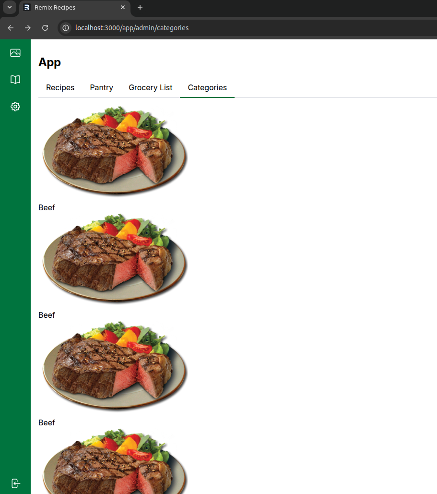

## 1.1.- (2 puntos) Se trata de conseguir lo siguiente:

Nota: Respete posicionamiento, tamaños, colores, márgenes internos y externos, bordes (redondeados), sombras, etc.

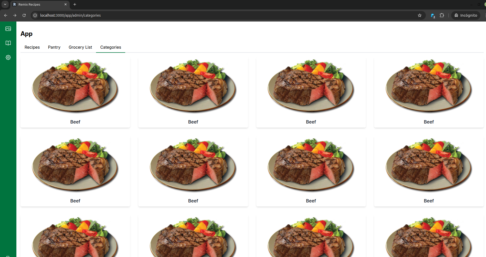

## 1.2.- (2 puntos) Consiga el siguiente comportamiento responsivo:


## 2.- Ruta `/app/admin/categories/Beef`.

Si pulsa sobre cualquiera de las categorías verá lo siguiente:

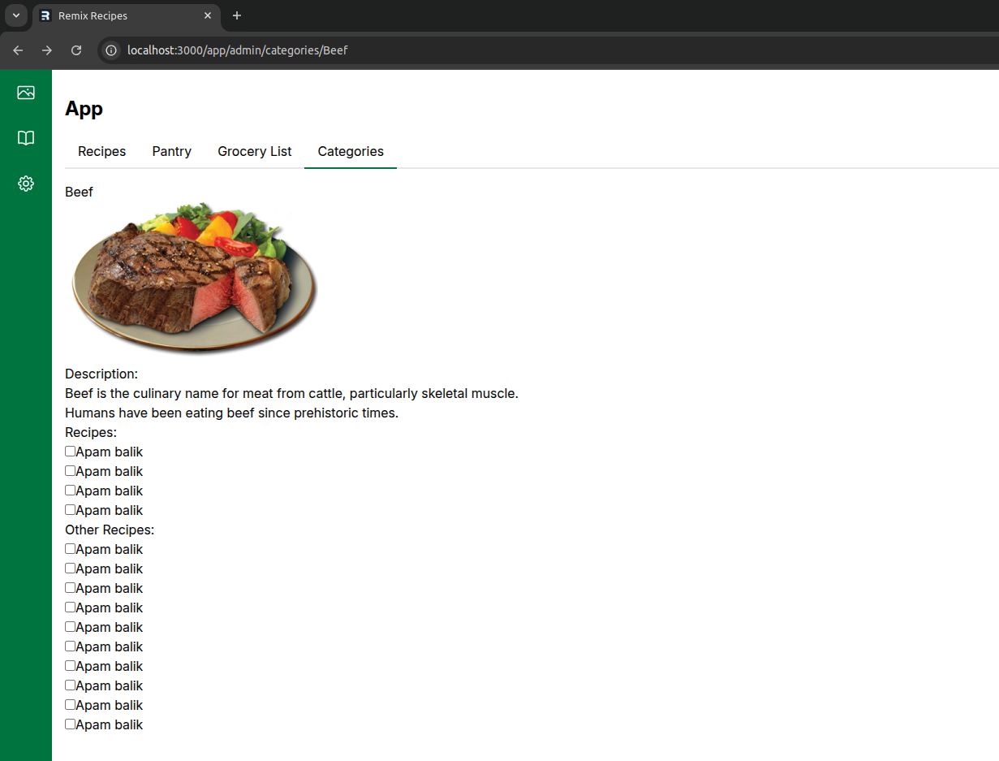

El objetivo es conseguir lo siguiente:

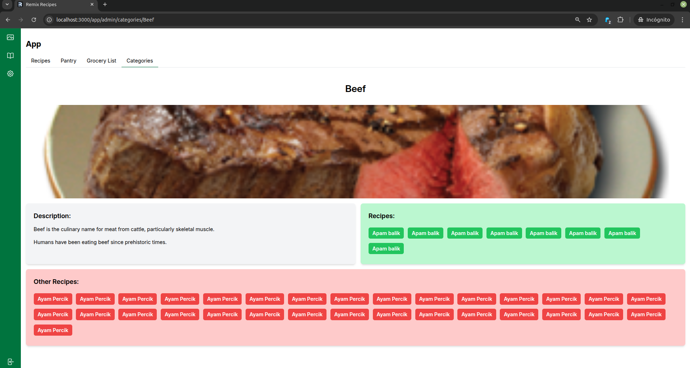

## 2.1.- (1 punto) Por conseguir mostrar el título de la categoría y la imagen tal y cómo se ve en la imagen anterior.

## 2.2.- (2 puntos) Por distribuir correctamente las secciones `description`, `recipes` y `other recipes`.

Nota: Respete tamaños, alineaciones, separación entre componentes.
Observe en la siguiente imagen que la altura de los contenedores se adapta a la cantidad de recetas:

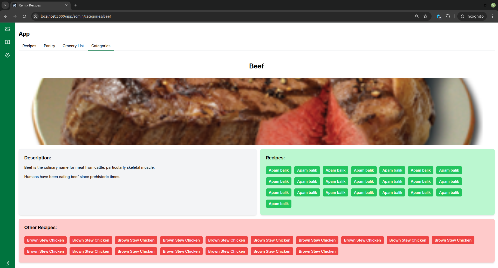

Observe en la siguiente imagen que la altura de los contenedores se adapta al tamaño de la descripción:

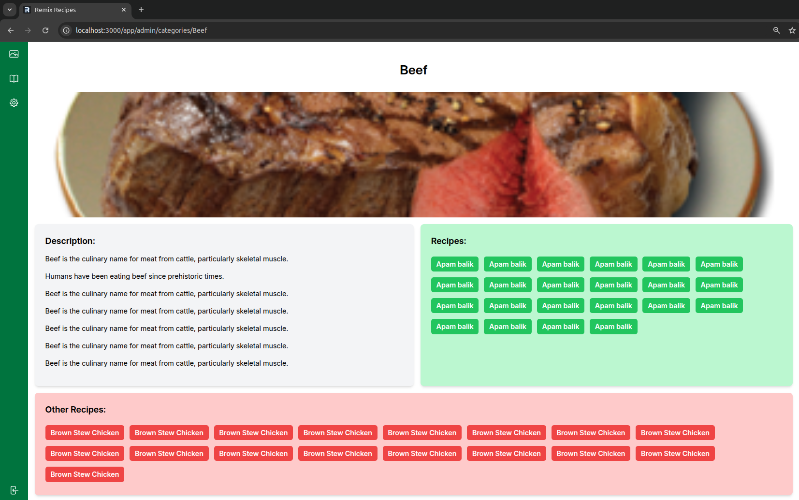

## 2.3.- (1 punto) Por el estilo interno de cada contenedor.

Nota: Respete colores, márgenes internos, alineación, bordes, sombras, etc.
Nota: El checkbox puede ocultarlo si le molesta ya que sólo es necesario en el examen de desarrollo.

## 2.4.- (2 puntos) Consiga el siguiente comportamiento responsivo:


# EXAMEN DE DESARROLLO

- No se puntuarán aquellos apartados que tengan errores de funcionalidad.
- No es suficiente que se haga lo que se pide, la implementación tendrá que ser también correcta.
- Se penalizará que haya errores de ejecución en la consola.
- Se penalizará que se dejen mensajes (console.log).
- Se penalizará el código comentado.

## 3.- Ruta `/app/admin/categories`.

## 3.1.- (0.5 puntos) Las categorías se cargarán desde la base de datos. Al pulsar sobre una categoría se navegará al detalle de categoría pasando el nombre de la categoría cómo parámetro (no se pasará el id como es habitual).

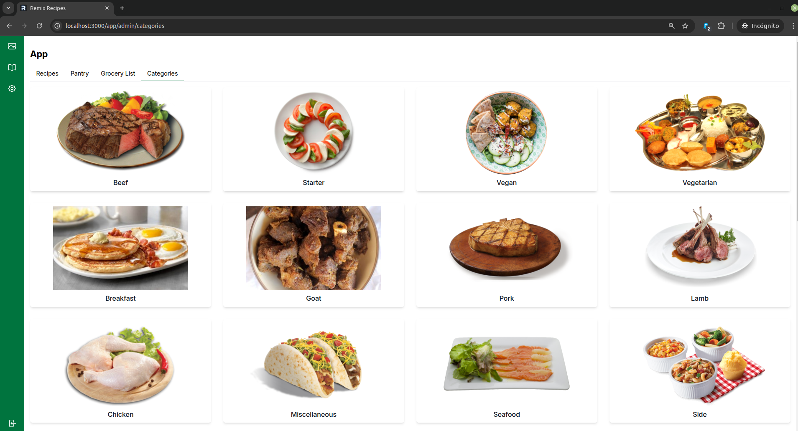

## 4.- Ruta `/app/admin/categories/${categoryName}`.

Al pulsar sobre una categoría, se navegará al detalle de la categoría. En detalle de la categoría se recuperará el parámetro que contiene el nombre y se buscará la información de la categoría y de sus recetas.

## 4.1.- (0.5 puntos) Por mostrar el nombre de la categoría recuperado del parámetro pasado y su imagen recuperada desde la base de datos a partir de su nombre.

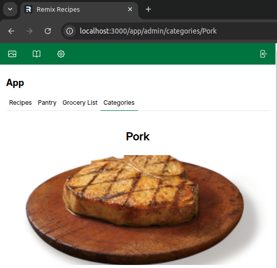

## 4.2.- (0.5 puntos) Por mostrar la descripción de la categoría separando cada oración en un párrafo.

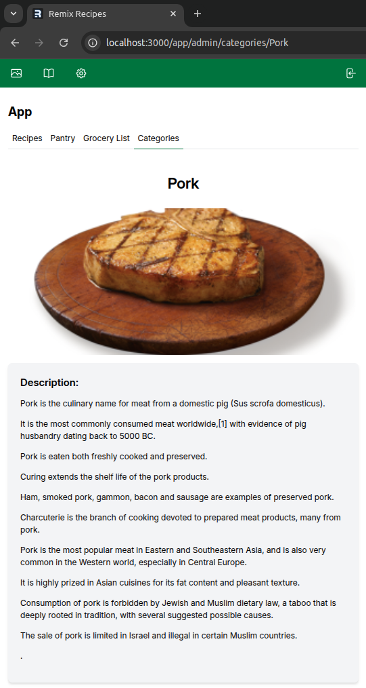

## 4.3.- (1 punto) Por mostrar las recetas de la categoría seleccionada ordenadas alfabéticamente.

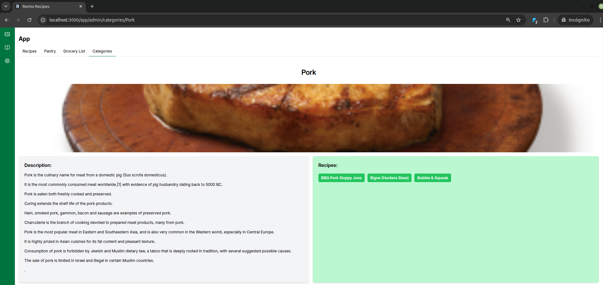

## 4.4.- (2 puntos) Por mostrar ordenadas alfabéticamente las recetas que no pertenecen a la categoría seleccionada.

Nota: Observe que en este apartado lo único que cambia con respecto al anterior es que las recetas que se muestran son distintas. Debe refactorizar el código creando un componente que se use en 4.3 y 4.4.

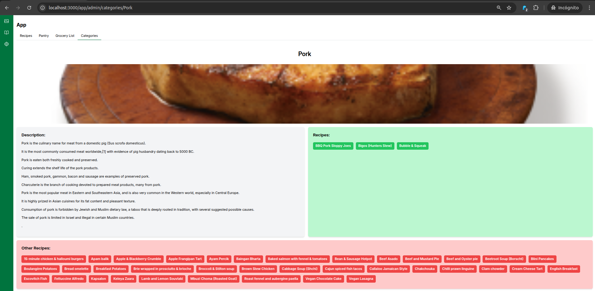

## 4.5.- (2 puntos) Al pulsar sobre una receta de la categoría, se pasará la receta pulsada a las recetas que no son de la categoría y viceversa.

Nota: Se debe usar el `checkbox` asociado a cada receta.
Nota: al `action` sólo se debe enviar la receta que ha cambiado y la acción a realizar: añadirla a la categoría o eliminarla de la categoría. Si se enviaran o/y actualizaran todas las recetas de la categoría sería muy ineficiente y se penalizaría severamente.
Nota: Se deben crear y usar lo/s esquema/s de `zod` para validar los parámetros enviados al `action`.

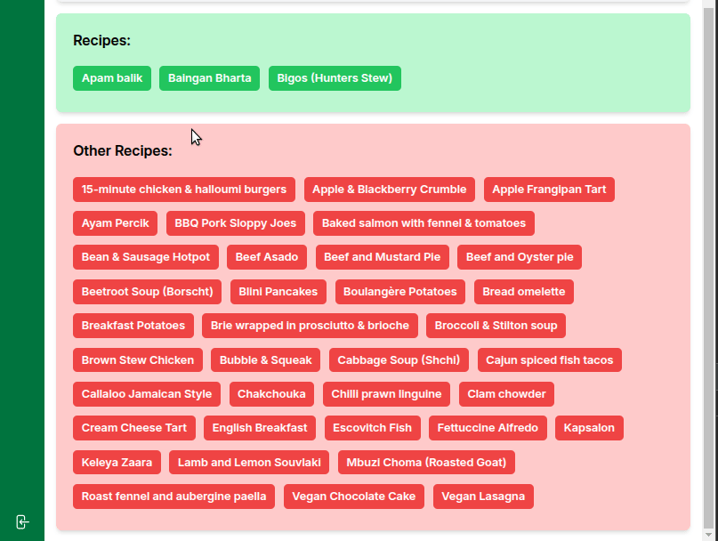

## 4.6.- (0.5 puntos) Si se intenta acceder a una categoría que no exista, se mostrará un error con el nombre de la categoría a la que se ha intentado acceder.

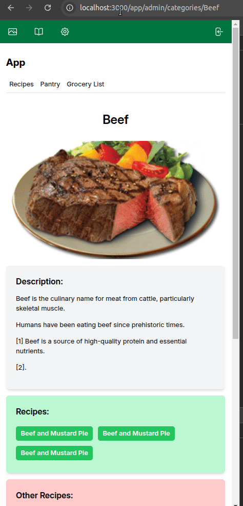

## 5.- Roles

Solo los usuarios con rol `root` pueden acceder a las rutas que empiecen por `/app/admin`.

## 5.1.- (1 punto) Si se intenta acceder a una ruta que esté en `/app/admin` se mostrará un error si el usuario conectado no tiene rol `root`.

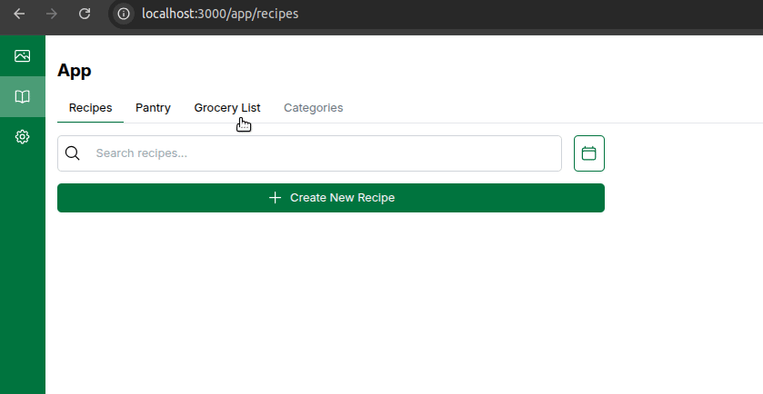

## 5.2.- (1 punto) El enlace a categorías estará oculto cuando el usuario no tenga rol `root`.

Nota: Los enlaces de la ruta `/app` se generan mediante un bucle que recorre un array que se pasa al componente `PageLayout`. Para puntuar en este apartado se tiene que seguir haciendo de la misma forma. Es decir, `PageLayout` seguirá recibiendo los enlaces a mostrar.

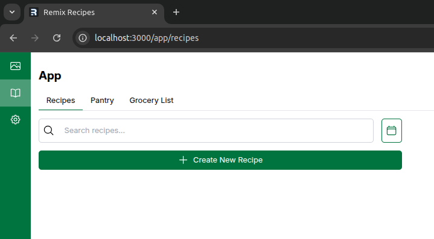

## 5.3.- (1 punto) Complete los dos tests del fichero `tests/category.spec.ts` que respectivamente deben comprobar que un usuario con rol `user` no puede acceder a `app/admin/categories` y un usuario con rol `root` sí lo puede hacer.

Nota: Para puntuar en este apartado es obligatorio que pase los tests. Es decir, que se debe haber hecho como mínimo el apartado 5.1.
Nota: Para ejecutar los test en línea de comandos y con el servidor de desarrollo parado, ejecute:

```bash
npm run test-ui
```

Nota: Con el comando `npm test` se han experimentado comportamientos extraños y no se recomienda hacerlo.

# Para entregar

- Ejecute el siguiente comando para comprobar que está en la rama correcta y ver los ficheros que ha cambiado:

```bash
    git status
```

- Prepare los cambios para que se añadan al repositorio local:

```bash
    git add .
    git commit -m "completed exam"
```

- Compruebe que no tiene más cambios que incluir:

```bash
    git status
```

- Dígale al profesor que va a entregar el examen.

- Conecte la red y ejecute el siguiente comando:

```bash
    git push origin <nombre-de-la-rama>
```

- Abandone el aula en silencio.
